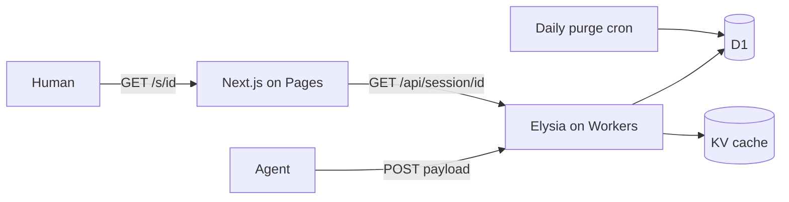

# Brief

Brief turns an agent's work into an interactive decision document: sections, diagrams, charts, code, math, and a set of yes/no or multiple-choice questions the human can answer inline. The agent sends one payload; the human gets one link.

Live example: https://brief.algoryth.me (production; the preview environment moves faster and may show newer features first).

## Why

Reviewing agent-built work needs structured documents, not a wall of chat. Hand-rolled HTML reports are expensive to generate and awkward to share or diff. Brief gives an agent a single POST request and gives the human a single link to read, annotate, and answer from any device.

## Quick start for agents

Install the skill:

```bash
npx skills add ENEmyr/brief
```

The skill tracks the payload schema, so pull the current version with `npx skills update brief` when the block types change.

Or call the API directly. A session is a JSON payload with a title, one or more sections of blocks, and an optional list of decisions:

```bash
curl -X POST https://brief-api.algoryth.me/api/session \
  -H 'content-type: application/json' \
  -d '{
    "payload": {
      "meta": { "title": "Add rate limiting to /api/session" },
      "sections": [
        {
          "id": "overview",
          "no": 1,
          "title": "Overview",
          "blocks": [
            { "type": "p", "text": "This document proposes rate limiting for the session endpoint." }
          ]
        }
      ],
      "decisions": [
        {
          "id": "limiter-choice",
          "q": "Which rate limiter should we use?",
          "multi": false,
          "opts": [
            { "id": "cf-ratelimit", "label": "Cloudflare Rate Limiting binding" },
            { "id": "custom-kv", "label": "Custom KV counter" }
          ]
        }
      ]
    }
  }'
```

The response is `{ "id": "...", "url": "https://brief.algoryth.me/s/<id>" }`. Send the human the `url`. The agent can later re-read the same document as plain markdown from `/api/session/<id>/raw` instead of regenerating it.

See `packages/schema/src/payload.ts` for the full schema.

## Features

- 22 block types, including interactive sequence, state, and layered diagrams, ERDs, charts (heatmap, histogram, scatter, 3D plot), math (KaTeX), and syntax-highlighted code (Shiki).
- Inline annotations on any text, with a "copy as prompt" action that turns a highlight and question into a ready-to-paste prompt for the agent.
- Decision cards that collect the human's answers and generate a reply prompt summarizing what was chosen.
- Markdown export at `/raw` so an agent can re-read a document without re-fetching or re-rendering the interactive version.
- Sliding expiry: unsaved sessions live 7 days, saved sessions live 90 days, and every open resets the window.
- Optional end-to-end encryption: the payload is encrypted client-side with PBKDF2 and AES-GCM before it ever reaches the server, so the server never sees the plaintext.
- Catppuccin-based Latte (light) and Mocha (dark) themes.

## Token savings

Per-document cost to an agent, comparing how the same review gets delivered:

| Approach               | Tokens per document | Reusable artifact          | Decisions round-trip |
| ----------------------- | -------------------- | --------------------------- | --------------------- |
| Ad-hoc HTML report      | ~30,000-50,000        | No                           | No                     |
| Markdown doc             | ~4,000-6,000           | Yes, but static              | No                     |
| Brief payload             | ~4,000-6,000           | Yes, via `/raw`               | Yes                    |
| Explaining in chat only | 20-40 percent more over a session | No           | No                     |

A Brief payload costs about the same to generate as a markdown doc, roughly 85-90 percent less than a hand-built HTML report, but stays interactive: the human can answer decisions and the agent can read the answers back. Explaining the same review in chat with no artifact tends to cost 20-40 percent more over a full session, because there is nothing to point back to and the context has to be re-explained. Every later re-read of a saved Brief document costs one `/raw` fetch instead of regenerating the document from scratch.

## Architecture

The web app is a statically exported Next.js site served from Cloudflare Pages. The API is an Elysia app running on Cloudflare Workers, backed by D1 for session storage and KV for read-through caching. A daily cron purges expired sessions from D1.



## Development

```bash
bun install
```

There is no single root dev server; each app runs its own:

```bash
cd apps/web && bun run dev   # Next.js dev server
cd apps/api && bun run dev   # wrangler dev
```

Quality gates, run from the repo root via Turborepo:

```bash
bun run lint
bun run typecheck
bun run test
bun run build
bun run e2e
```

Monorepo layout: `apps/web` (the reader UI), `apps/api` (Elysia worker, D1 schema, save/session/state features), `packages/schema` (the payload Zod schema shared by both apps), `packages/config` (shared tooling config), `e2e` (end-to-end tests).

## Documentation

- [docs/concept.md](docs/concept.md) explains what Brief is, the agent-to-reader loop, and the session lifecycle.
- [docs/architecture.md](docs/architecture.md) covers the Cloudflare deployment, the data flow, and the monorepo layout.
- [docs/api.md](docs/api.md) is the endpoint reference, with request and response examples for every route.
- [docs/skill.md](docs/skill.md) describes how an agent authors and publishes a payload, including the full block type table.

Architecture decision records live in `docs/adr/`, and `CONTEXT.md` at the repo root is the domain glossary.

## License

MIT. See `LICENSE`.
