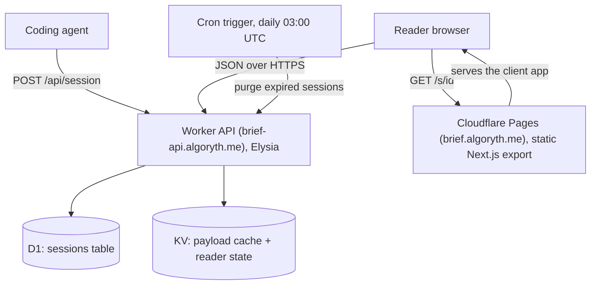
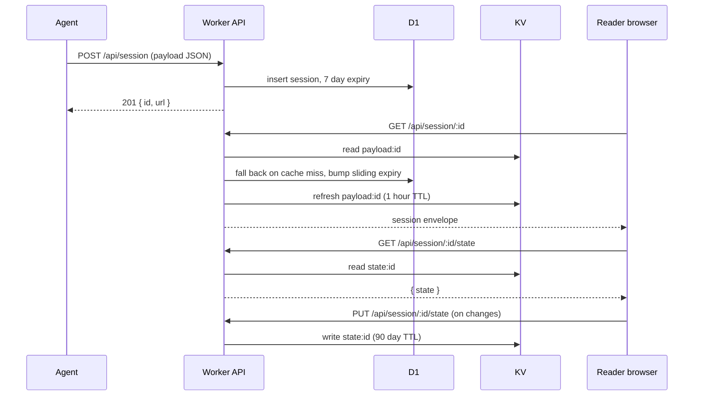
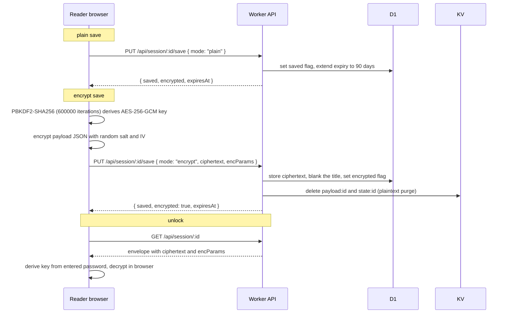

# Architecture

Brief is two deployables on Cloudflare plus a shared schema package. The reader UI is a statically exported Next.js site served from Cloudflare Pages at `brief.algoryth.me`. The API is an Elysia app running on a Cloudflare Worker at `brief-api.algoryth.me`, backed by D1 for session storage and KV for a payload read-through cache and for reader state blobs. A daily cron trigger on the Worker purges expired sessions.

## Infrastructure

D1 holds the sessions table: id, payload (JSON or ciphertext), title, saved and encrypted flags, encryption params, and the timestamps that drive the sliding expiry. KV holds two kinds of keys: `payload:id` is a one hour read-through cache of the session row, and `state:id` is the reader state blob (annotations and decision answers) with a 90 day TTL.

## Data flow

The publish, read, and state-sync path:

The save, encrypt, and unlock path. Encryption is entirely client side: the browser derives an AES-256-GCM key from the reader's password with PBKDF2-SHA256 at 600000 iterations, encrypts the payload JSON, and sends only the ciphertext and the derivation parameters. The server never sees the password or a derived key.

After an encrypt save the server also rejects any further `PUT /api/session/:id/state` for that session with 403, so plaintext reader state can never be re-created against a protected document. Reader state for a protected session lives in browser memory only.

## Monorepo layout

The repository is a Bun and Turborepo monorepo. `apps/web` is the Next.js reader UI, built as a static export. `apps/api` is the Elysia Worker with the D1 schema, migrations, and the session, save, state, and purge features. `packages/schema` is the Zod payload schema and the markdown export, shared by both apps so the API validates exactly what the UI renders. `packages/config` holds shared tooling configuration. `e2e` contains the Playwright tests that run the web and API pair together against local wrangler dev servers.

## Frontend serving details

The Pages site is a fully static export, so there is no per-session server rendering. A `_redirects` rule (`/s/* /s/ 200`) rewrites every session URL to the same client-rendered page, which then fetches the session envelope from the API by id. Heavy renderers (Shiki syntax highlighting, KaTeX math, and the chart and diagram components) are lazy loaded so a document that does not use them does not pay for them on first paint.

## Deploys

Deployment is trunk based and tag gated. Every push to `main` deploys the preview environment: the `brief-api-preview` Worker and the Pages preview at `main.brief-web-d38.pages.dev`, including D1 migrations. Production deploys only when a `v*` tag is pushed; that workflow applies migrations to the production D1 database and deploys the production Worker and Pages project behind the custom domains. Preview therefore moves faster than production and may show newer features first.
