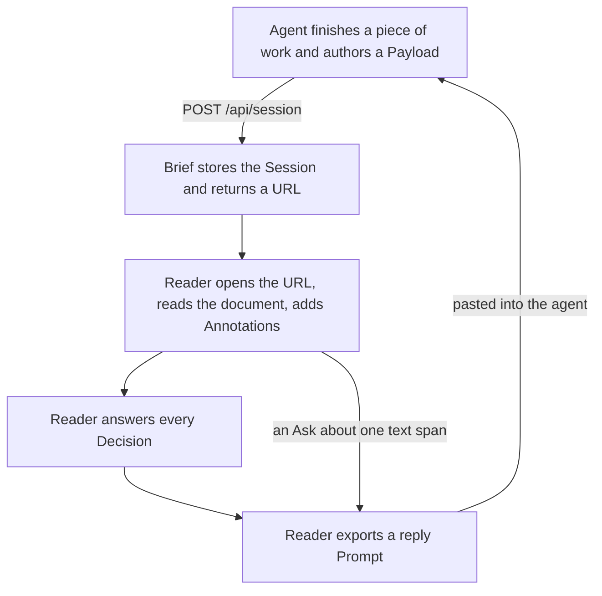

# Concept

Brief is a platform where a coding agent publishes a decision document and a human reads it, annotates it, and decides on it. The agent sends one JSON Payload and gets back one URL. The human opens that URL, reads the document, answers the Decision cards inline, and exports a reply Prompt that goes straight back into the agent. Nothing about the review lives in a chat scrollback; the document is the artifact.

This file uses the project's domain vocabulary (Session, Payload, Section, Block, Decision, Save, Protected Session, and so on). See [CONTEXT.md](../CONTEXT.md) for the ubiquitous language; every term is defined there and the definitions in that file are authoritative.

## Why it exists

Reviewing agent-built work needs structure: sections, diagrams, tables, comparisons, and explicit questions. A wall of chat text gives you none of that, and a hand-rolled HTML report is expensive for the agent to generate and awkward for the human to share or answer. Brief splits the work along its natural seam. The agent, which knows the material, authors a structured Payload once. The reader, who has the judgment, gets an interactive document that collects answers and turns them back into text the agent can act on.

## The loop

The loop closes in two ways. Answering all Decisions unlocks Prompt crafting, which summarizes the choices as paste-ready text. Independently, any single Ask (a question anchored to a text span) can be exported as its own Prompt carrying the document URL, the anchor, and the quoted text, so the agent can find the exact spot being asked about. Agents that want to re-read a Session later fetch the Raw Export at `/api/session/:id/raw`, a clean Markdown rendering, instead of scraping HTML or regenerating the document.

## Session lifecycle

A Session is immutable content (the Payload) plus mutable reader state (Annotations and Decision answers). Its lifetime is a sliding window measured from the last open.

A freshly created Session lives 7 days. Every open resets the clock, so a document that is still being read stays alive, and one that nobody opens quietly ages out. A daily purge removes expired Sessions from storage.

Save is a reader action that marks a Session as worth keeping. It extends the sliding window from 7 days to 90 days; the window still slides, so a Saved Session that keeps being opened keeps living. Anyone holding the URL can Save.

Saving with a password turns the Session into a Protected Session. The Payload is encrypted end to end in the browser before it reaches the server, so the server stores only ciphertext and can never read the content. Opening a Protected Session requires the password, entered in the browser. There is no recovery path: losing the password loses the content permanently. A Protected Session has no Raw Export, its title is blanked on the server at protection time, and its reader state stays in browser memory only. The reasoning behind this design is recorded in [the encryption ADR](adr/0001-end-to-end-encryption.md).
